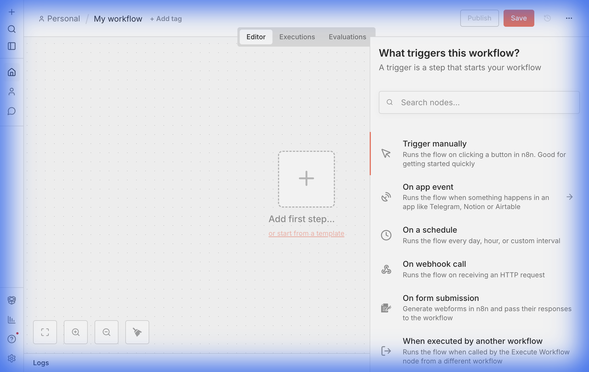
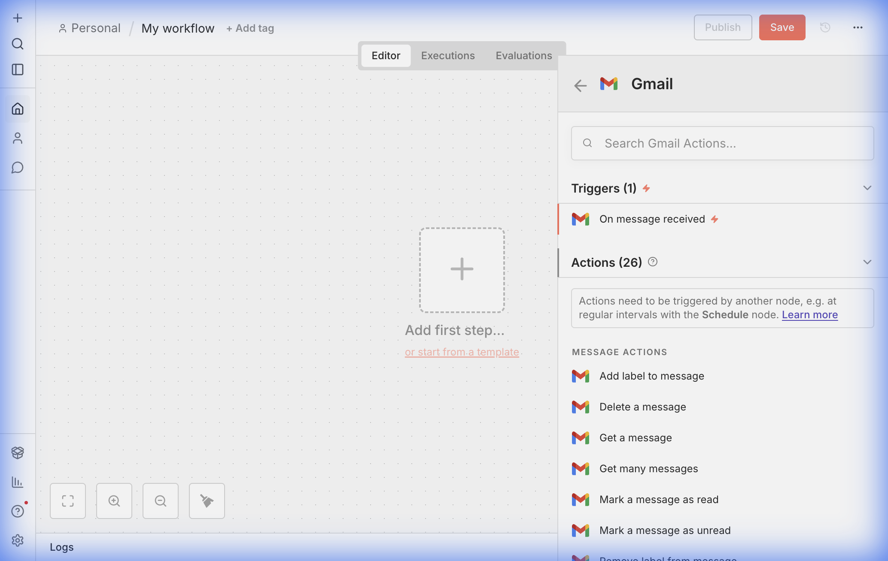
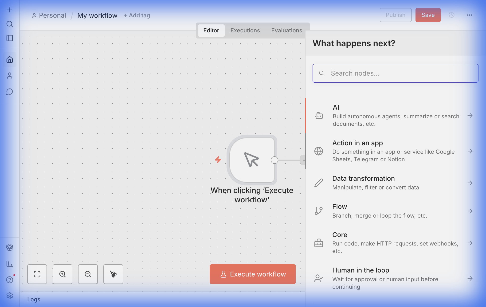
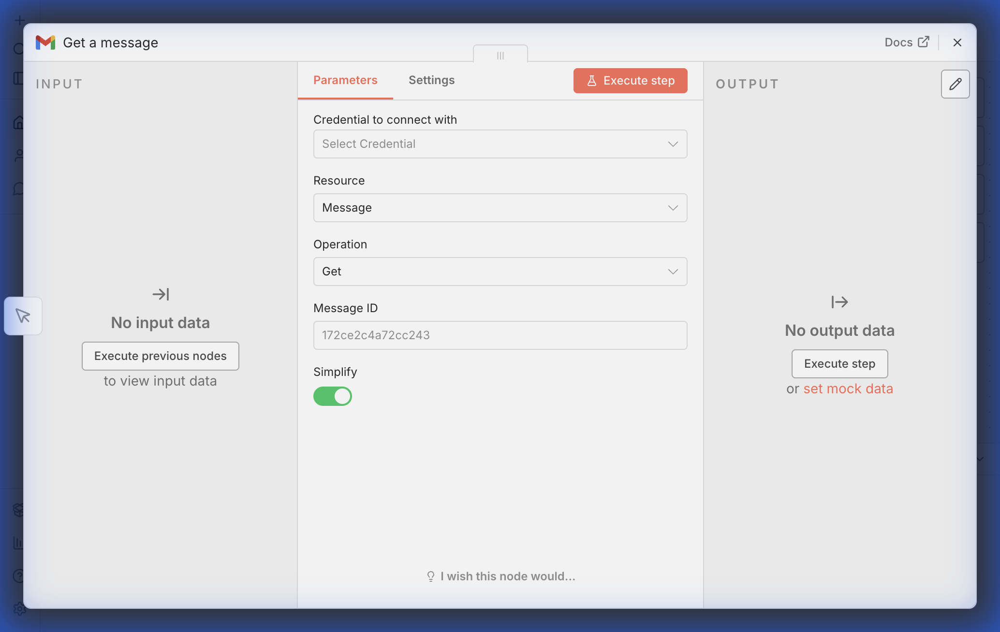
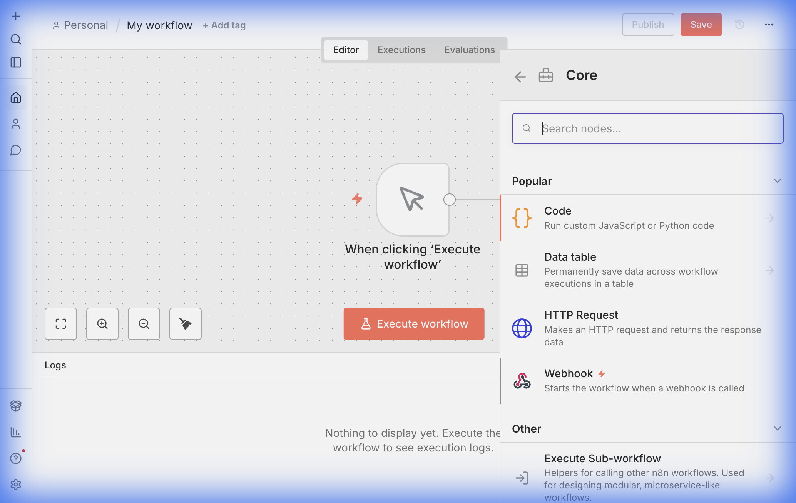
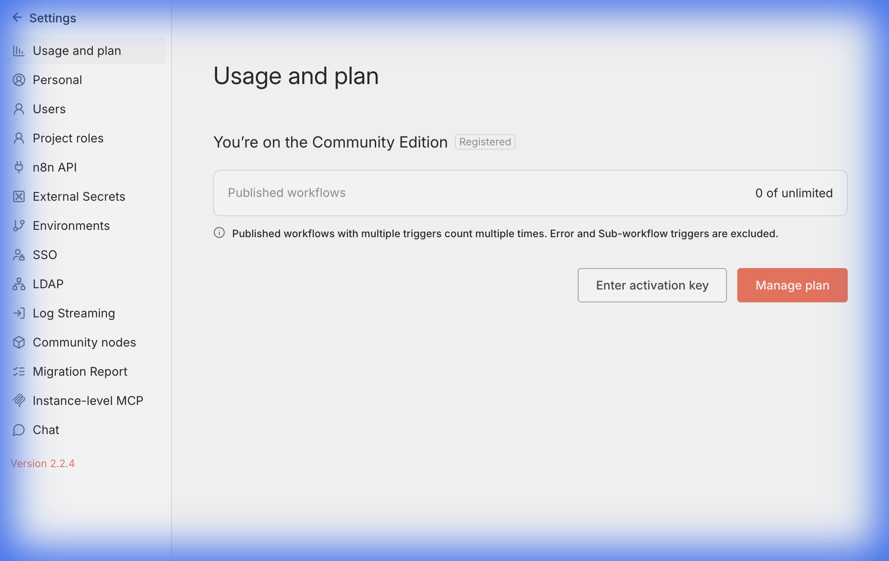

#  從原始需求找到適合自己的節點（開始前的準備工作）

> 在動手搭建 n8n 工作流之前，最重要的不是「去找節點」，而是先把「需求拆清楚」。當你清楚自己需要調用哪些外部服務、在哪些環節需要觸發與處理，就能更快在節點面板裡鎖定目標。

---

## 1. 先從「原始需求」倒推出所需節點

以「把稍後閱讀的文章存到 Notion，並由大模型自動分類」為例，需要的能力通常包括：

- 閱讀器：來源端（如 Omnivore、RSS、Pocket 等）
- 接收入口：當閱讀器不支持直連 Notion 時，選一個「接收連結」的服務（如 Telegram 機器人、微信服務號等）
- 正文抽取：把網頁 URL 轉換為「文章正文」的服務
- Notion：存儲文章與分類結果
- 大模型：做摘要與分類（可用 n8n AI 節點或外部 API）

動手前先做兩件事：

- 列出每一步可能用到的「具體服務名稱/工具關鍵詞」
- 在 n8n 節點面板搜索這些關鍵詞；若無現成節點，則考慮「半開放式節點」

> 參考：複雜抽取/改寫可看《 半開放式節點（Code/HTTP Request）詳細介紹》。

---

## 2. 理解「觸發節點 vs 執行節點」

- 觸發節點（Triggers）：可以作為工作流的「起點」。如「定時」、「收到一條消息」、「點擊 Test Workflow 按鈕」等。
- 執行節點（Actions）：不能做第一個節點，必須被觸發後執行。複雜處理邏輯通常由執行節點完成。

以 Gmail 為例：

- 觸發節點：On Message Received（每隔一段時間檢查是否有新郵件，有則觸發流程）
- 執行節點：讀取郵件、標記已讀/未讀、添加/移除標籤、刪除、發送郵件等

> 為什麼「讀取郵件」是執行節點？
> 「收到新郵件」只是通知（Trigger），真正「讀取內容/處理內容」發生在後續（Action）。

---

## 3. 用「菜單分類邏輯」快速定位節點

n8n 節點有兩個重要維度：是否依賴外部服務、扮演觸發還是執行角色。

- 外部節點（依賴外部服務 API）
  - 觸發：如 Gmail 收到新郵件
  - 執行：如 通過 Gmail 發送郵件
- 自有節點（不依賴外部，或基於標準協議如 HTTP/HTML/OS）
  - 觸發：點擊「Test Workflow」、Webhook（HTTP 入站）等
  - 執行：邏輯類（條件/循環/合併/數據處理）、代碼節點
- 人工智能節點：為 AI 設計的複合型節點（如 LLM Chain、Agent、Chat Trigger）

結合面板可大致解讀：

- Action in an app：外部服務封裝（如 Google Sheets、Gmail）【外部節點】
  - 每個服務下再分 Trigger 與 Action
- 數據處理：過濾與轉換【自有/執行】
- Flow：條件、循環、合併等邏輯【自有/執行】
- Core：代碼、HTTP 等【自有/執行】
- 添加另一個觸發器：新增一個 Trigger 入口

---

## 4. 理解「外部服務節點」的本質

外部服務節點 = 對目標服務官方 API 的「可視化封裝」。

- n8n 能力通常是該服務 API 能力的「子集/映射」
- 複雜 API 可能被拆為多個更直觀的節點
- 好處：
  - 抽象易懂：把原本抽象的 API 設計轉為直觀動作
  - 低代碼：無需手寫大量 HTTP/鑑權即可調用官方 API

例：Gmail 的「Mark a message as read」

- 官方 API 本質是操作系統標籤（Label）
- 你也可用「Add/Remove label」實現，但封裝節點更直觀

---

## 5. 找不到節點時的出路：半開放式節點

當搜索不到現成節點時：

- 用 Code 節點（JS/Python）完成數據改寫、拼裝、輕邏輯
- 用 HTTP Request 節點直連任意 API（含鑑權、Body/Headers、重試/批次等）

> 詳見《 半開放式節點（Code/HTTP Request）詳細介紹》。

---

## 6. 註冊你的社區版用來獲得更多的功能

n8n 的自部署社區版（又或稱開源版）完成部署後，你能見到的功能都是免費的。但有一些功能，需要註冊後才能啟用，包括：

- 文件夾功能 - 允許你創建文件夾來整理你的 Workflow。
- 在編輯器中調試 - 將一條執行記錄從 Executions 複製到編輯器進行調試。
- 24 小時修訂歷史 - 允許你回退到一條 Workflow 在過去 24 小時中的任何一次修改。
- 自定義執行程序 - 保存、查找和注釋執行元數據。

註冊步驟：

1. 新部署：初始化完成後出現註冊界面，輸入有效郵箱即可激活
2. 已部署：
   - 左下角「···」 → Settings → Usage and Plan
   - 點擊 「Unlock」 → 輸入郵箱 → 「Send me a free license key」
   - 前往郵箱查收 Key
   - 回到 Settings → Usage and Plan → 「Enter activation key」 完成激活

---

## 7. 開始前檢查清單（Checklist）

- 需求是否拆清楚：來源、轉換、存儲、AI、通知各組件？
- 觸發方式確定了嗎：定時/消息/按鈕/Webhook？
- 搜到合適的外部節點了嗎：服務名/關鍵詞試過多種？
- 無現成節點的環節：是否由 Code/HTTP Request 替代？
- 是否已註冊開源版：便於調試、回退和管理？

> 牢記：先清需求，再分類找節點；節點不夠用，就用「半開放式」補齊能力。祝你構建順暢！
