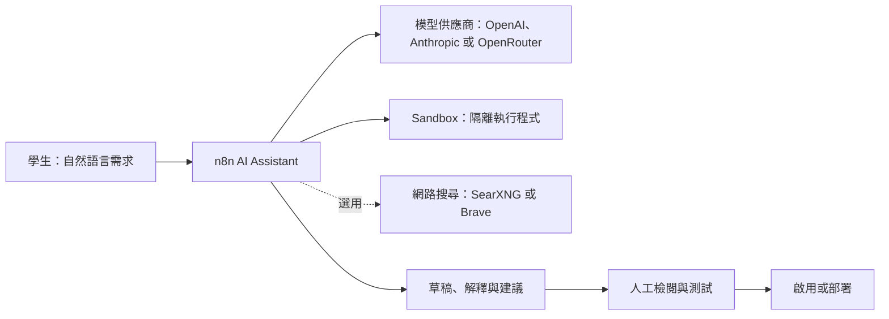

# n8n AI Assistant：功能與應用情境

n8n AI Assistant 是 n8n 編輯器內的 AI 協作功能。它能協助將需求拆成工作流、解釋節點與錯誤、提出 JSON 草稿，以及在啟用 Agent 模組時協助建立 Agent 雛形。它的定位是「協作與草稿」，不是可以跳過測試直接上線的自動化工具。

n8n 官方將 Assistant 標示為 Preview：它可能犯錯，任何產出的工作流都必須由人員審閱及測試後才能使用於正式環境。[官方設定文件](https://docs.n8n.io/deploy/host-n8n/configure-n8n/set-up-n8n-assistant/)

## 1. 從哪裡開啟

登入 `http://localhost:5678` 後，從左側選單點選 **AI Assistant**。首次使用請先完成模型、Sandbox 與選用網路搜尋設定，詳見同資料夾的 [n8n-Assistant與Sandbox部署教學.md](n8n-Assistant與Sandbox部署教學.md)。


完成後，左側會出現 **AI Assistant**，可能有 **Preview** 標記。看不到此選項時，先檢查服務、模型與 Sandbox 設定，不要急著要求它建立工作流。

## 2. 它需要什麼



| 元件 | 是否必要 | 課堂角色 |
| --- | --- | --- |
| 模型供應商與 API key | 必要 | 理解問題並提出草稿。 |
| Sandbox | 必要 | 將程式執行等動作放進隔離環境。 |
| 網路搜尋 | 選用 | 查詢最新文件或網路資料。 |

官方建議本機開發、教學使用 `n8n-sandbox`；正式環境採用受管理的 Daytona Sandbox。不要在對話中提供 API key、Sandbox 密鑰、學生個資或客戶資料。[官方 Sandbox 說明](https://docs.n8n.io/deploy/host-n8n/configure-n8n/set-up-n8n-assistant/#what-n8n-assistant-needs)

## 3. 可協助的工作

| 類型 | Assistant 可協助 | 人員仍需完成 |
| --- | --- | --- |
| 需求拆解 | 把「表單送出後寄信」拆為 Trigger、資料整理、寄信與通知。 | 確認流程符合真實規則。 |
| 節點說明 | 解釋 Webhook、If、Edit Fields、HTTP Request 與表達式。 | 用測試資料實際執行。 |
| 工作流草稿 | 建議節點順序、參數與 JSON 草稿。 | 檢查格式、節點版本、憑證與錯誤處理。 |
| 除錯 | 根據已遮蔽的錯誤訊息提出排查順序。 | 驗證修正，且不提供 token。 |
| Agent 雛形 | 依角色、工具與限制提出 Agent 設計。 | 決定權限、資料範圍與人工核准點。 |

## 4. 可以寫 JSON 嗎？

可以請它產生或修改 JSON 草稿，但不保證一定能匯入。因此採用以下流程：

1. 先請它列出節點與資料流。
2. 要求它輸出「只有 JSON」的草稿。
3. 存成 `.json`，在 n8n 以 **Import from File** 匯入。
4. 補上憑證、檢查節點設定與錯誤分支。
5. 用假資料測試；全部通過後才儲存或啟用。

可直接貼上的提示詞：

```text
不要直接啟用工作流。請先列出設計，再輸出一份完整、可匯入 n8n 的 workflow JSON。

需求：建立「課程聯絡表單」流程。
1. Webhook POST 路徑為 demo-contact。
2. 接收 name 與 email。
3. 用 Edit Fields 整理兩個欄位。
4. Respond to Webhook 回傳 ok、message、name。
5. 不使用任何 credential。
6. JSON 之外不要輸出文字。
```

本機實測中，Assistant 能回覆一般問題，但直接建立工作流曾回報格式錯誤。這是很好的教學案例：AI 的第一稿必須視為待審核程式碼，而非已完成範本。

## 5. 五個課堂應用情境

### A. 從自然語言設計第一個工作流

```text
請把「Google Form 新回覆後寄送課前提醒 Email」拆成節點清單。
請說明每個節點的輸入、輸出與可能失敗處，再提出最小可行版本。
```

重點：Trigger、欄位命名、憑證與測試資料。

### B. 讀懂已匯入的範本

```text
請用初學者能理解的方式說明 Webhook、Edit Fields、If、Respond to Webhook 各自負責什麼。不要改動工作流，只給我檢查清單。
```

重點：先理解資料如何流動，再改節點。

### C. 排查 API 的 401 錯誤

```text
HTTP Request 節點收到 401 Unauthorized。不要要求我提供 API key。請列出可能原因與每一項可安全檢查的位置。
```

重點：憑證類型、Authorization header、Token 過期與測試 URL。

### D. 摘要後人工核准再寄出

```text
請設計每日市場新聞摘要流程，包含資料取得、去重、摘要、人工核准、寄送五階段。請指出哪些步驟不能完全交給 AI 決定。
```

重點：來源可靠性、人工核准與寄出前檢查。

### E. 規劃 RAG Agent 最小版本

```text
請設計 RAG Agent 的最小架構：文件上傳、文字切分、Embedding、向量庫、檢索、回答與引用來源。請列出 n8n 可能使用的節點類型。
```

重點：RAG 是先檢索再生成，必須檢查回答是否能回到原始資料來源。

## 6. 講師 10 分鐘示範流程

1. 問 Assistant：「請用一句話說明 Webhook 的用途。」
2. 用情境 A 請它做節點拆解，不直接產生工作流。
3. 請學生找出草稿缺少的欄位、憑證與錯誤處理。
4. 將需求縮小後要求 JSON 草稿。
5. 匯入、用假資料測試；失敗時讓 Assistant 解釋錯誤，再由學生修正。

## 7. 使用規則

- 不貼 API key、密碼、個資、學生名冊與客戶機密。
- 不直接啟用 Assistant 產生的流程。
- 每份 JSON 至少檢查輸入、輸出、例外、憑證與人工核准五項。
- 會寄信、寫資料庫或呼叫付費 API 的流程，先在測試模式執行。
- 作業可繳交「需求、AI 草稿、修正紀錄、測試證據」，不只繳最終 JSON。

## 延伸閱讀

- [n8n 官方：設定 n8n Assistant](https://docs.n8n.io/deploy/host-n8n/configure-n8n/set-up-n8n-assistant/)
- [n8n 官方：Docker Compose 安裝](https://docs.n8n.io/deploy/host-n8n/install-options/install-using-docker-compose/)
- [本課程：Assistant 與 Sandbox 部署](n8n-Assistant與Sandbox部署教學.md)
