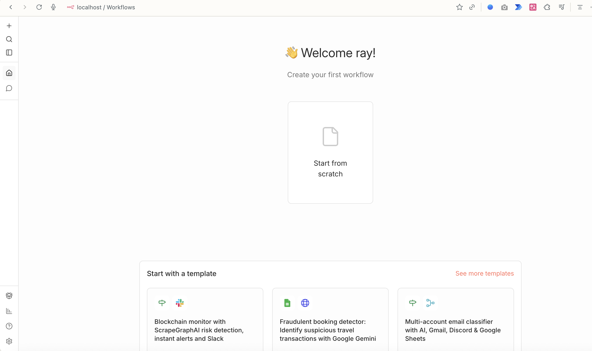
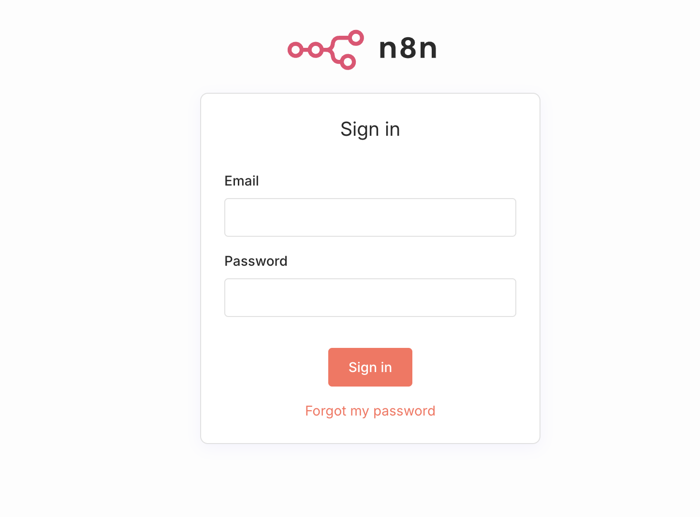

# n8n Assistant 與 n8n Sandbox 本機部署教學

本章將既有的 n8n Docker Compose 擴充為可使用 **n8n Assistant**、**n8n Sandbox** 與選用的 **網路搜尋**服務。完成後，Assistant 可在隔離的短生命週期環境中執行程式或檢查資料，而不是在 n8n 主容器直接執行。

適用情境：課堂、個人電腦與開發環境。本教材的 Sandbox 使用 Docker-in-Docker，因此不建議直接當成公開正式環境；正式環境請依 n8n 官方建議改用受管理的 Sandbox 供應商（例如 Daytona），並做好網路與權限隔離。

## 本章完成後的架構

```text
瀏覽器
  │ http://localhost:5678
  ▼
n8n ───────────────► sandbox-api ── mTLS ──► sandbox-runner-1
  │                                                  │
  └──────────────────────────────────────────────────┘
                       建立短生命週期執行環境

n8n ───────────────────────────────────────────────► searxng（選用網路搜尋）
```

只有 n8n 對主機公開 `5678` 連接埠。`sandbox-api`、runner 與 SearXNG 均只在 Docker Compose 的內部網路通訊。

## 先備條件

1. 安裝並啟動 Docker Desktop。
2. 開啟終端機，進入本週資料夾：

   ```bash
   cd "/你的路徑/n8n/01_第1週-n8n啟航與AI-Agent/Assistant與Sandbox部署"
   ```

3. 確認 Docker 與 Compose 可用：

   ```bash
   docker --version
   docker compose version
   ```

4. 建議至少保留 2 顆 CPU 與 4 GB 可用記憶體。第一次下載映像檔需要網路及較長時間。

> 注意：`sandbox-runner-1` 需要 `privileged: true` 才能在 Docker 中建立隔離執行環境。不要替它加上 `ports:`，也不要把它部署到不受控的公網主機。

## 畫面一：n8n 首頁與 Assistant 入口

啟動成功後，在瀏覽器開啟 `http://localhost:5678`，由左側選單進入 **AI Assistant**。下圖為 n8n 本機首頁的畫面核對；不同版本的選單文字與位置可能略有差異。



## 1. 檢視本課程已提供的檔案

本週資料夾已經包含下列檔案，學生不需要從零寫 Compose：

| 檔案 | 用途 |
| --- | --- |
| `docker-compose.yml` | 啟動 n8n、Sandbox API、Sandbox runner、憑證初始化與 SearXNG。 |
| `.env.example` | 不含真實密鑰的環境變數範本。 |
| `searxng-settings.yml` | 讓 SearXNG 能回傳 Assistant 可用的 JSON 搜尋結果。 |

Docker Compose 會啟動五項服務：

| 服務 | 角色 | 對主機開放連接埠 |
| --- | --- | --- |
| `n8n` | 工作流與 Assistant 網頁介面 | `5678` |
| `sandbox-certs` | 首次啟動時建立 mTLS 憑證，完成即結束 | 無 |
| `sandbox-api` | n8n 與 runner 的協調服務 | 無 |
| `sandbox-runner-1` | 執行隔離程式的 Docker-in-Docker runner | 無 |
| `searxng` | Assistant 的選用網路搜尋後端 | 無 |

## 2. 建立自己的 `.env` 密鑰檔

`.env` 內的值可讓 Sandbox API、runner 與 SearXNG 彼此驗證。這是本機私密設定，不能提交到 Git。

### 2-1. 先複製範本

請在終端機逐行執行，並確認提示字元所在位置是本資料夾：

```bash
cd "/你的路徑/n8n/01_第1週-n8n啟航與AI-Agent/Assistant與Sandbox部署"
cp .env.example .env
ls -la .env .env.example
```

最後一行應列出 `.env` 與 `.env.example`。如果顯示 `No such file or directory`，表示尚未進入正確的 `Assistant與Sandbox部署` 資料夾。

若資料夾已經有 `.env`（例如先前已設定 n8n Owner 帳號），**不要**再執行複製指令；請保留原本內容，只在檔案末端加入下列四個欄位。

### 2-2. 產生四組不同的密鑰

在終端機逐行執行下列四次。每次會印出一組 64 個英數字元；請先暫時貼在自己的密碼管理工具或未同步的暫存文件中，並標示對應欄位名稱。不要把畫面截圖上傳到公開群組。

```bash
openssl rand -hex 32
openssl rand -hex 32
openssl rand -hex 32
openssl rand -hex 32
```

範例畫面（這些是示意文字，不可照抄成真正密鑰）：

```text
SANDBOX_API_KEYS                    ← 第 1 次輸出
SANDBOX_API_RUNNER_REGISTRATION_TOKEN ← 第 2 次輸出
SANDBOX_API_RUNNER_API_KEY          ← 第 3 次輸出
SEARXNG_SECRET                      ← 第 4 次輸出
```

### 2-3. 開啟並填寫 `.env`

Mac 使用者可執行：

```bash
open -e .env
```

若已安裝 VS Code，也可以執行：

```bash
code .env
```

Windows 使用者請以檔案總管開啟 `Assistant與Sandbox部署`，啟用「顯示副檔名」後，以 Notepad 或 VS Code 開啟 `.env`。請確認檔名是 `.env`，不是 `.env.txt`。

將四次輸出依序貼到下列等號右側。等號兩側不要加空白、不要加引號、不要換行拆開一個值：

```dotenv
SANDBOX_API_KEYS=第1次openssl輸出
SANDBOX_API_RUNNER_REGISTRATION_TOKEN=第2次openssl輸出
SANDBOX_API_RUNNER_API_KEY=第3次openssl輸出
SEARXNG_SECRET=第4次openssl輸出
```

填完後按儲存。這是 `.env` 的最小完整結構；不要把真實值貼到 Markdown、作業截圖或 GitHub：

```text
SANDBOX_API_KEYS=••••••••（第 1 組，不顯示真實值）
SANDBOX_API_RUNNER_REGISTRATION_TOKEN=••••••••（第 2 組）
SANDBOX_API_RUNNER_API_KEY=••••••••（第 3 組）
SEARXNG_SECRET=••••••••（第 4 組）
```

### 2-4. 不洩漏內容的檢查

此指令只回報每個欄位是否已填妥，不會印出密鑰：

```bash
awk -F= '
/^(SANDBOX_API_KEYS|SANDBOX_API_RUNNER_REGISTRATION_TOKEN|SANDBOX_API_RUNNER_API_KEY|SEARXNG_SECRET)=/ {
  print $1 ": " (length($2) >= 32 ? "已設定" : "長度不足或未設定")
}' .env
```

預期畫面：

```text
SANDBOX_API_KEYS: 已設定
SANDBOX_API_RUNNER_REGISTRATION_TOKEN: 已設定
SANDBOX_API_RUNNER_API_KEY: 已設定
SEARXNG_SECRET: 已設定
```

接著檢查 Git 不會追蹤 `.env`：

```bash
git check-ignore -v .env
```

正確結果應指出專案的 `.gitignore` 規則。若指令沒有輸出，先停止，不要執行 `git add .env`，應先補上忽略規則。

### 畫面二：登入 n8n

啟動後開啟 `http://localhost:5678`。第一次使用依畫面建立 Owner 帳號；已建立過帳號則會看到下方登入頁。Owner 密碼與 `.env` 的 Sandbox 密鑰是不同資料，兩者都不得提交到 Git。



## 3. 啟動前驗證 Compose

先讓 Docker 解析設定；這一步不會啟動容器：

```bash
docker compose config --quiet
```

沒有任何輸出代表設定可被解析。接著可確認服務清單：

```bash
docker compose config --services
```

預期可見 `n8n`、`sandbox-certs`、`sandbox-api`、`sandbox-runner-1` 與 `searxng`。

## 4. 啟動 Sandbox 堆疊

執行：

```bash
docker compose up -d
```

第一次執行時 Docker 會下載映像檔並建立資料卷。稍候 20 到 60 秒，再查看狀態：

```bash
docker compose ps
```

預期狀態：

```text
sandbox-api        running (healthy)
sandbox-runner-1   running
searxng            running
n8n-course         running
```

`sandbox-certs` 是一次性服務；顯示 `exited (0)` 屬於正常情況，因為它只負責建立憑證。

## 5. 從終端機驗證 Sandbox

確認 API 健康狀態：

```bash
docker compose exec -T n8n wget -qO- http://sandbox-api:8080/healthz
```

預期輸出：

```json
{"status":"ok"}
```

若需查看 runner 是否已向 API 註冊：

```bash
docker compose logs --tail=100 sandbox-runner-1
```

畫面中應能找到 runner 已建立連線、註冊或心跳成功的訊息。不要把 `.env` 值貼到課堂投影、截圖或 GitHub issue。

## 6. 在瀏覽器完成 Assistant 設定

1. 開啟 `http://localhost:5678/assistant`。
2. 首次進入時選擇 **Finish setup**。
3. 在 Code sandbox 步驟，系統應顯示 **Found in server configuration**。這表示下列 Compose 環境變數已被 n8n 讀取：

   ```text
   N8N_INSTANCE_AI_SANDBOX_ENABLED=true
   N8N_INSTANCE_AI_SANDBOX_PROVIDER=n8n-sandbox
   N8N_SANDBOX_SERVICE_URL=http://sandbox-api:8080
   ```

4. Web search 也應顯示 **Found in server configuration**；其來源是 `N8N_INSTANCE_AI_SEARXNG_URL=http://searxng:8080`。
5. 選擇 **Continue**。n8n 會自動進行 Sandbox 驗證，成功時會顯示 Sandbox 已啟動並成功執行命令的訊息。
6. 在模型步驟連接一個支援的模型供應商。課堂已使用 OpenAI；模型 credential 是 Instance AI 的設定，與工作流節點內的 OpenAI credential 是不同用途的設定。
7. 選擇 **Start using AI Assistant**，即可進入聊天頁。

### 畫面三：設定完成後的介面核對

完成後，左側會出現 **AI Assistant**，上方有 **Preview** 標示；聊天區可以直接輸入問題。以下是本機完成設定後的實測畫面狀態。

```text
AI Assistant  Preview

請用一句話說明 n8n Assistant 的用途。

n8n Assistant 用於協助使用者設計、自動化和管理工作流程，
提高工作效率並解決自動化相關問題。
```

若畫面顯示 Code sandbox 或 Web search 是 **Not set**，請重新載入 n8n 容器並回到設定頁：

```bash
docker compose up -d --force-recreate n8n
```

## 7. 課堂驗收練習

學生完成後，請逐項勾選：

- [ ] `docker compose config --quiet` 成功。
- [ ] `docker compose ps` 中的 `sandbox-api` 顯示 `healthy`。
- [ ] 健康檢查回傳 `{"status":"ok"}`。
- [ ] 瀏覽器 Assistant 設定頁的 Code sandbox 顯示由伺服器設定找到。
- [ ] Assistant 設定頁的 Web search 顯示由伺服器設定找到。
- [ ] Assistant 可以回答「請用一句話說明 n8n Assistant 的用途」。

## 已完成的本機實測紀錄

本教材已在本機 Docker Compose 與瀏覽器實作驗證：

| 項目 | 結果 |
| --- | --- |
| Compose 設定驗證 | `docker compose config --quiet` 成功。 |
| Sandbox API 健康檢查 | 回傳 `{"status":"ok"}`。 |
| runner | 已啟動並完成註冊／心跳連線。 |
| n8n 設定精靈 | Code sandbox 與 Web search 均顯示由 server configuration 找到。 |
| Sandbox 自動驗證 | n8n 介面顯示 Sandbox 啟動並成功執行命令。 |
| Assistant | 已在瀏覽器成功回覆測試問題。 |

## 常見問題與排除

### `sandbox-api` 沒有顯示 healthy

依序查看狀態與日誌：

```bash
docker compose ps
docker compose logs --tail=100 sandbox-certs
docker compose logs --tail=100 sandbox-api
```

先確認 `.env` 四個欄位都有值，且 `SANDBOX_API_RUNNER_REGISTRATION_TOKEN` 與 `SANDBOX_API_RUNNER_API_KEY` 沒有被誤貼成同一組或含有前後空白。修正後重新建立服務：

```bash
docker compose down
docker compose up -d
```

### Runner 沒有連上 API

檢查：

```bash
docker compose logs --tail=150 sandbox-runner-1
```

Docker Desktop 必須正在執行，且電腦需允許 privileged 容器。Apple Silicon 或公司管控電腦若禁止 nested Docker，請請管理員確認 Docker Desktop 的權限與資源配置。

### Assistant 無法回答或模型設定失敗

Sandbox 只提供隔離執行環境，不提供 LLM。回到 Assistant 的模型設定，建立有效的模型 credential，確認帳號有可用額度與 API 權限。不要把模型 API key 放進本教材、Workflow JSON 或 Git。

### 要停止或完全重建嗎？

暫停服務但保留資料：

```bash
docker compose stop
```

再次啟動：

```bash
docker compose start
```

若要重建服務設定但保留 n8n 資料卷：

```bash
docker compose up -d --force-recreate
```

不要隨意執行 `docker compose down -v`；它會移除 n8n 與 Sandbox 的資料卷，可能讓既有工作流與憑證遺失。

## 官方參考資料

- [n8n Assistant 自架設定與 Sandbox 供應商](https://docs.n8n.io/deploy/host-n8n/configure-n8n/set-up-n8n-assistant/)
- [n8n 使用 Docker Compose 安裝](https://docs.n8n.io/hosting/installation/docker/#docker-compose)
- [n8n Sandbox 專案](https://github.com/n8n-io/n8n-sandbox)
