#  n8n 常用邏輯節點詳解

##  概述

對於學習編程來說，不管是任何語言，首先需要學習的就是邏輯與判斷。儘管 n8n 捨棄了編碼的過程，但對於製作 Workflow 來說，本質上仍然是在用圖形化進行編程，因此你需要用到一系列邏輯節點。

在 n8n 中，邏輯節點被歸類在 **Flow** 類目下，也就是流程控制。

##  支持的流程控制節點

| 節點名稱 | 功能說明 |
|---------|----------|
| **Filter** | 過濾，從上游輸入的一堆 items 裡過濾掉不滿足條件的 |
| **If** | 判斷，根據上游輸入的數據判斷給出 true 和 false 結果，並將數據流分叉成兩個 |
| **Loop Over Items** | 循環，將上游輸入的一堆 items 中的每一個，運行一遍 loop 中的部分，當所有 items 運行完畢之後，將所有運行結果打包輸出給下游 |
| **Merge** | 合併，將兩個上游輸出的數據合併成一個 |
| **Compare Datasets** | 比較，將兩個上游輸出的數據進行比較，並決定在什麼情況下用哪一個輸出給下游 |
| **Execute Workflow** | 執行另一個 Workflow |
| **Stop and Error** | 停止 Workflow 並輸出錯誤 |
| **Switch** | 路由，可以理解為 If 的進階版，根據上游輸入的數據進行多重判斷，並依據結果將數據流分叉成多個 |
| **Wait** | 等待，運行到這裡暫停一會兒，主要用於向第三方 API 發起請求時避免超過對方訪問限制 |

>  **提示**：流程控制節點一般來說非常簡單，如果你能理解它所對應的邏輯本身，你在看完這個表之後應該已經知道如何用了。

##  實戰案例詳解

如果你此前沒有過任何編程經驗，下面我們會通過四個實際的例子來講解 **If**、**Switch**、**Merge**、**Loop** 四個 n8n 中最常用的邏輯控制節點。

---

### 案例1：使用 If 節點進行條件判斷

**場景**：我有一張數據表，其中一列是文章標題，我希望在後續的 Workflow 中對包含「評論」的內容單獨處理，我該如何操作？

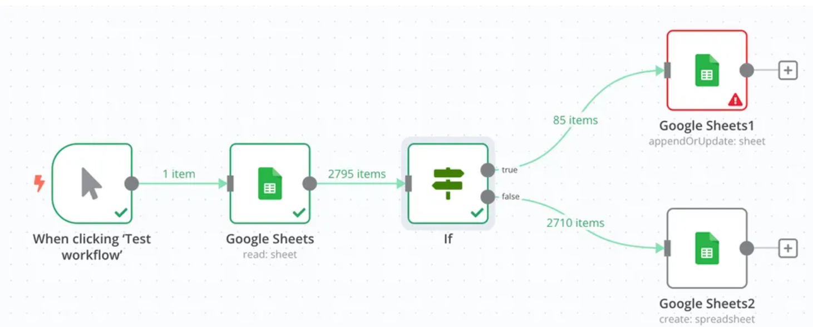

#### 實現步驟：

1. **配置 If 節點**：使用它來判斷標題中是否存在「評論」兩個字
2. **設置條件**：添加一個 Conditions（條件），以 `{{ $json['標題'] }}` 為判斷源
3. **判斷邏輯**：如果它 contains（包含）「評論」二字，就返回 true，否則就返回 false

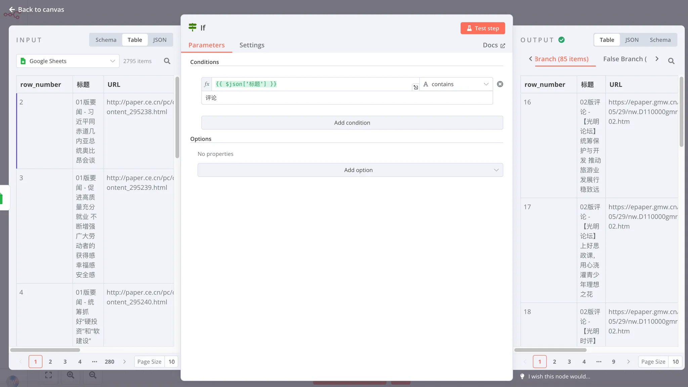

#### 結果說明：

在 Output 面板，我們可以看到後續 Workflow 被分為了：
- **True Branch**：85 個 item（包含「評論」的文章）
- **False Branch**：2710 個 item（不包含「評論」的文章）

#### 高級功能：

- **多種判斷類型**：支持字串、數字、日期與時間、布爾值、數組和對象字段類型的判斷
- **邏輯連接符**：支持多個 Conditions 之間用 AND（且）與 OR（或）連接
- **示例**：可以設置判斷「包含評論」且「包含高質量」，或者判斷「包含評論」或「包含高質量」

---

### 案例2：使用 Switch 節點進行多重判斷

**場景**：我有一張數據表，其中一列是文章標題，我希望在後續的 Workflow 中對「包含評論」、「包含高質量」、「包含要聞」的內容分別單獨處理，我該如何操作？

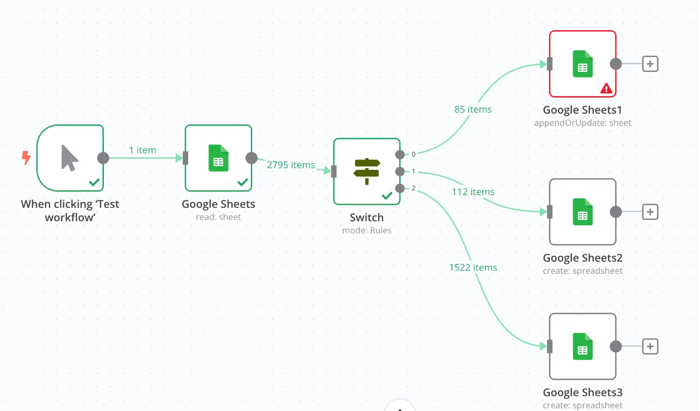

#### 為什麼選擇 Switch？

經過 If 的學習，你應該會意識到，這個案例中的判斷，其實可以通過設置多層 If 實現。比如先處理包含評論的，再處理包含高質量的，最後再處理包含要聞的。但這樣會增加 Workflow 的複雜程度，還會降低它的運行效率。

因此，在面臨這種需要處理兩個以上分叉路徑的邏輯時，我們就可以用更複雜的 **Switch** 來處理。

#### 實現效果：

Switch 節點支持你添加多個判斷邏輯，它會根據每個判斷邏輯將匹配的數據送往對應的分叉。運行之後，數據流被分為三叉：
- 標題裡有「評論」的
- 標題裡有「高質量」的  
- 標題裡有「要聞」的

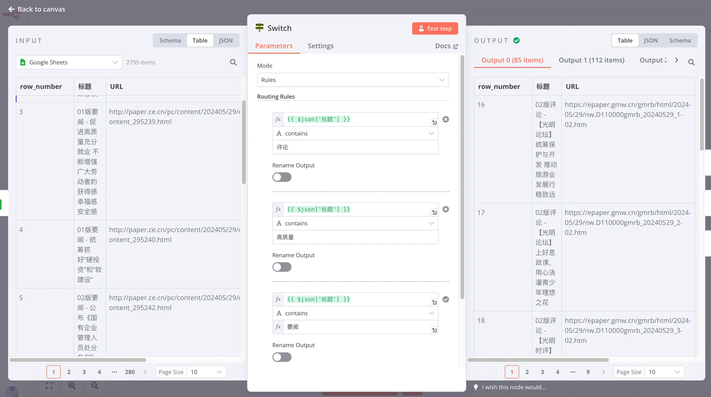

#### 重要配置選項：

**串聯判斷模式（默認）**：
- 按照配置路由規則的上下順序，從上到下判斷
- 一條數據如果已經被匹配到了分叉1，它就不會再出現在分叉2里

**並聯判斷模式**：
- 在 Options 里開啟 `Send data to all matching outputs`
- 一條數據在同時滿足分叉1和分叉2的情況下，會同時出現在兩個分叉里

---

### 案例3：使用 Merge 節點合併數據流

**場景**：我從數據表中篩選出了對「包含評論」、「包含高質量」和「包含要聞」的內容，我現在分別對他們的數據處理已經完成，現在希望把它們合併回一個數據流寫進庫里，怎麼辦？

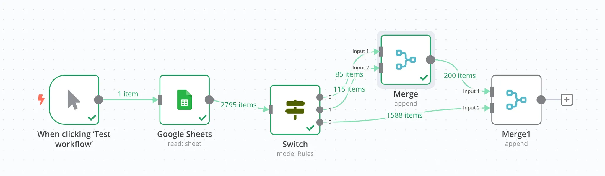

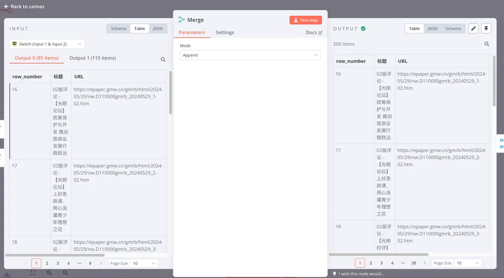

#### 實現方法：

由於 Merge 節點一次只能合併兩個分叉，所以我們要合併兩次：
1. 先合併兩個分叉
2. 再將第三個與已經合併後的分叉進行合併

#### 合併模式選擇：

由於我們的三個分叉出來的數據流在表頭（屬性）上是一致的，因此我們可以直接選擇 **Append** 作為合併模式。

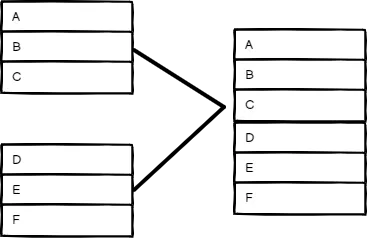
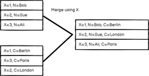
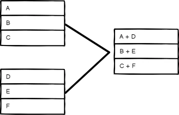
#### 三種合併模式詳解：

| 模式 | 說明 | 適用場景 |
|------|------|----------|
| **Append** | 直接將分叉2的數據加在分叉1的後面 | 表頭（屬性）完全一致的兩個分叉合併 |
| **Combine** | 將分叉2與分叉1同一索引的不同表頭合併到一起 | 分叉2裡有姓名和年齡，分叉1裡有姓名和性別，合併後獲得包含姓名、年齡和性別的數據表 |
| **Merge by Position** | 按分叉2和分叉1的數據位置，直接把兩個數據強加在一起 | 適用範圍比較窄，特殊場景使用 |

---

### 案例4：使用 Loop 節點處理多個 RSS 源

**場景**：從多個 RSS 處獲取內容怎麼辦？

#### 重要概念：內置循環

n8n 中支持 **Loop Over Items** 節點來創造一個循環。但是，在大部分情況下你不需要該節點來創造循環。

**是不是不太理解 為什麼？**

當我們在日常編程的時候，如果需要對一個數據表中的每一行進行處理，我們首先想到的是需要構造一個循環。但對於 n8n 來說，它考慮到了這種常見用法，因此許多 n8n 中的節點是**內置循環**的。

#### 內置循環示例：

上游節點傳來了一個包含10行包含URL的數據表，你在當前節點想用 RSS Read 讀取這10個RSS地址裡的內容，你實際上不需要用到 Loop Over Items。

在默認情況下，當你就將一個數組變量拖動到當前節點的時候，當前節點就會將數組變量中的每一行都執行一遍。

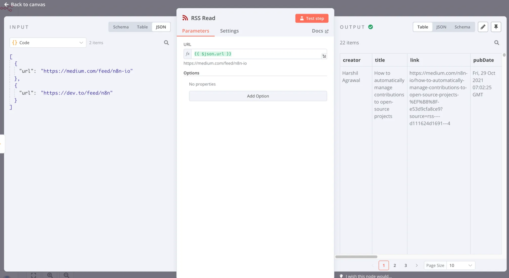

#### 控制循環執行：

如果你想讓某個節點在處理某個數組變量裡的值時，只運行一次，你需要在節點的 Settings 頁面打開 **Execute Once** 選項。

#### 條件結束循環：

n8n 節點中的內置循環，甚至包含了依據條件結束循環，你只需要這樣連接一個 If 節點即可：
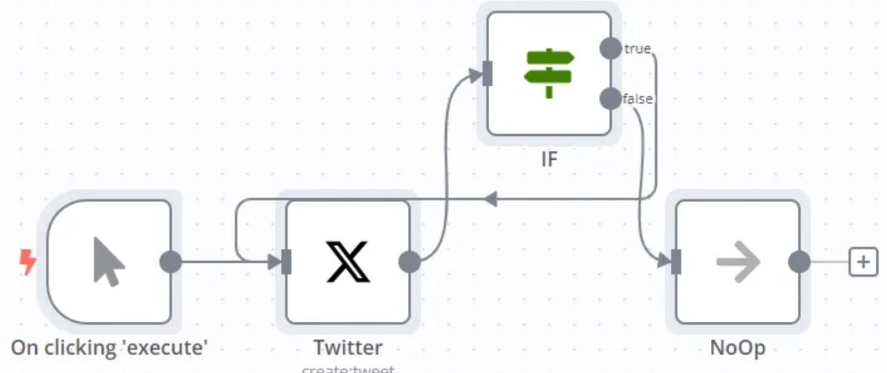
在這個官方示例中，If 的 True 分叉被指回了 Twitter 節點的輸入端。這意味著，在 Twitter 節點被運行到第5次時，節點會進入 false 分叉結束循環。

if節點的判斷條件是 {{$runIndex}} Is Less Than 4

**該工作流的結果**：會自動在 Twitter 上發送5遍 "Hello from n8n!"

#### 何時使用 Loop Over Items？

在一些特殊的情況下（比如想要分批處理），我就想用 Loop 來構造循環怎麼辦？

**實現方式**：

添加一個 Loop Over Items，它會將上游傳遞過來的 URL，分批次循環執行 RSS Read。當所有的批次執行完畢之後，數據被合併推送到 done 分叉，執行後續的循環外操作。
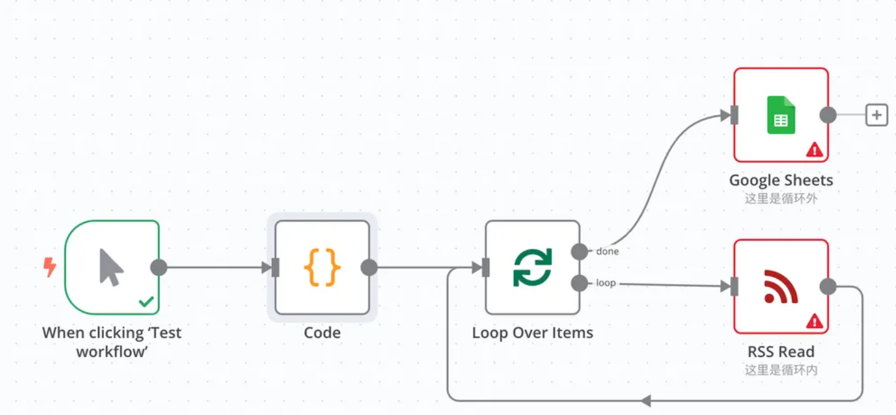
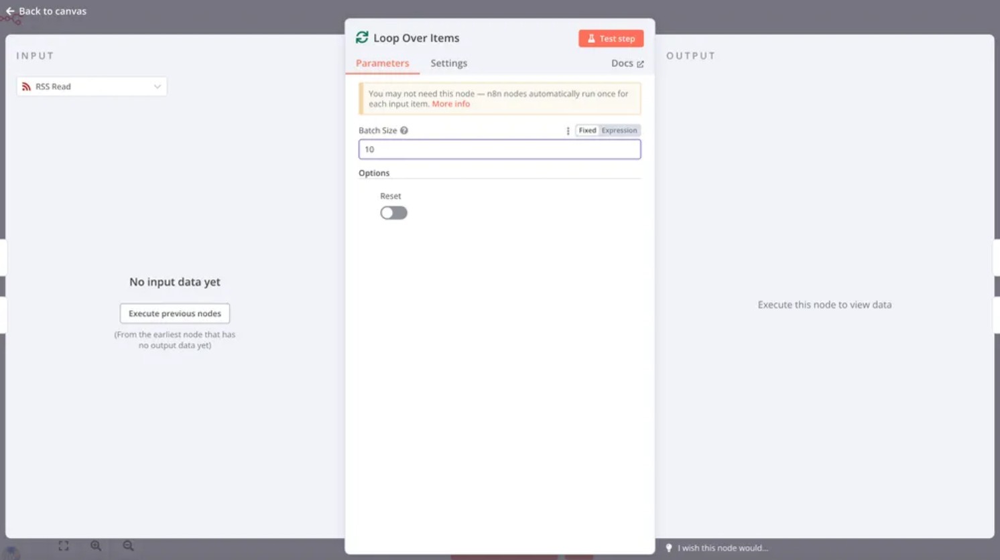
**與內置循環的區別**：

在這裡我將 Loop Over Items 的 **Batch Size** 參數設置為了10。這意味著，它會首先將上游傳遞過來的數據，拆分成10行一包，每次只向循環中的 RSS Read 發送10包。

**實際應用**：

如果我在循環內加一個 Wait 節點，並且設置為 Wait 1分鐘，就可以有效的控制每分鐘只對10個RSS地址發起請求，拉長請求間隔，避免被對方服務器封禁。

#### 建議使用 Loop Over Items 的場景：

1. **分批處理數據**：以控制 Workflow 的性能消耗
2. **錯誤隔離**：你十分確定輸入進來的數據有時會導致節點運行錯誤，你希望在某一行運行錯誤的情況下，剩下的行依然能繼續處理
3. **頻度控制**：你希望控制數據處理的頻度，以保障第三方 API 可以正常運行

---

##  總結

通過這四個案例的學習，你應該已經掌握了 n8n 中最常用的邏輯控制節點：

- **If**：簡單的條件判斷和分流
- **Switch**：複雜的多重判斷和路由
- **Merge**：數據流的合併操作
- **Loop**：循環處理和批量操作

這些節點是構建複雜 Workflow 的基礎，掌握它們的使用方法，你就能創建出功能強大的自動化工作流了！

---
