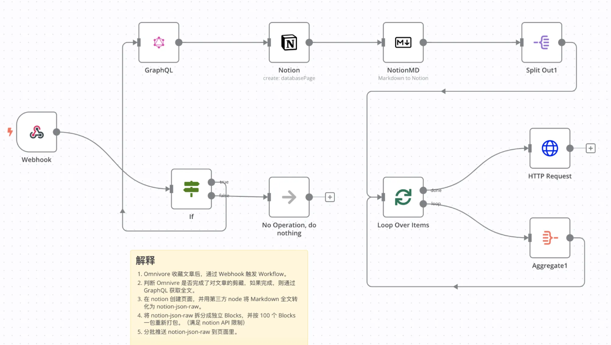
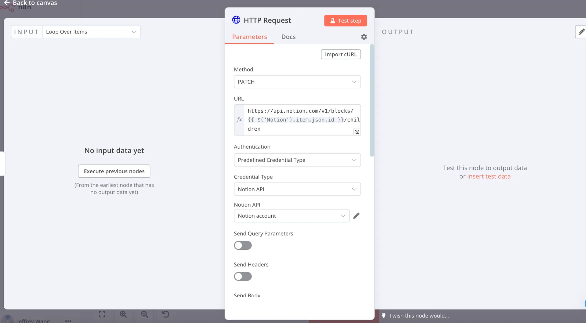
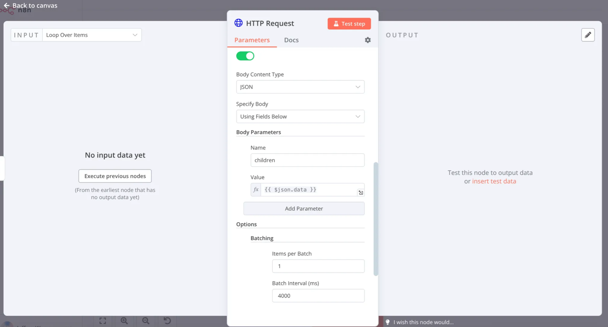

#  半開放式節點（Code / HTTP Request）詳細介紹

與 Coze 這類「全封裝在線服務式」流程工具相比，n8n 的一大優勢是「半開放式節點」。當官方未提供現成集成時，你仍可用這些節點手動對接能力：
- Code：直接寫 JavaScript 或 Python 以實現自定義邏輯
- HTTP Request：對任意 URL 發起 HTTP 請求，集成任意對外 API（如飛書、企業微信、國產大模型等）

>  如果你完全不想寫代碼，n8n Cloud 提供 AI Code 功能：用自然語言描述需求，由 AI 生成可運行的 Code 節點。

---

## 1. Code 節點

Code 節點允許你以最小的限制直接編寫邏輯，彌補「無現成節點可用」的空缺。

### 1.1 參數概覽

| 參數 | 說明 |
|---|---|
| Mode | 運行模式：Run Once for All Items / Run Once for Each Item |
| Language | 腳本語言：JavaScript 或 Python（JS 更穩定、生態更全）|
| Code | 實際執行的腳本內容，支持引用上游數據（需手寫表達式）|

- Mode 選擇建議：
  - Run Once for All Items：對「整組數據」進行整體操作（如彙總、拼接、增刪列）
  - Run Once for Each Item：對「每一行數據」單獨處理（如逐條改寫字段）

### 1.2 引用上游數據示例（JavaScript）

以下示例將上游節點 `Aggregate` 的 `data`（文章數組）拼接為一段帶序號的整文：

```javascript
const articles = $node["Aggregate"].json["data"]; // 上游節點變量
let fullText = "";
let index = 1;

articles.forEach((article) => {
  fullText += `第${index}篇標題: \n# ${article.title}\n第${index}篇正文:\n${article.markdown}\n第${index}篇source: ${article.link}\n\n`;
  if (index < articles.length) {
    fullText += "---------------\n\n";
  }
  index++;
});

return [{ json: { fullText } }];
```

> 提示：`$node["節點名"].json[...]`、`$json[...]` 等可讀取上游數據；Code 節點裡可以直接從 INPUT 面板拖拽，無需「手寫變量表達式」。

### 1.3 注意事項

- 模塊依賴：默認僅內置少量 JS 庫，如需更多庫請參考官方文檔啟用
  - 佔位鏈接：Enable modules in Code node | n8n Docs
- 文件操作：Code 節點不讀寫本地文件。需配合 `Read File(s) From Disk` / `Write File to Disk` 節點
- 網絡請求：Code 節點不建議直接發起 HTTP 調用。請改用 `HTTP Request` 節點
- Python 運行時：基於 Pyodide，庫較少、性能一般；若無剛需優先選 JS

---

## 2. HTTP Request 節點

顧名思義，它用於向任何可訪問的 URL 發起 HTTP 請求。是對接未內置服務（如飛書、企微、國產大模型等）的「總入口」。

### 2.1 常見使用場景

- 從第三方 API 拉取數據（天氣、股市、社交平台等）
- 向外部服務提交數據（創建記錄、推送消息、提交表單）
- 觸發自建接口或爬蟲入口
- 連接 n8n 未原生集成的服務（只要有 API 即可）

### 2.2 參數概覽

| 參數 | 說明 |
|---|---|
| Method | 請求方法：GET / POST / PUT / DELETE / HEAD / OPTIONS / PATCH |
| URL | 請求地址，支持表達式注入上游變量 |
| Authentication | 鑑權：None / Predefined Credential Type / Generic Credential Type |
| Send Query Parameters | 查詢參數（key-value）|
| Send Headers | 請求頭（Content-Type、Authorization 等）|
| Send Body | 請求體（Raw / JSON / Form 等）|
| Options | 進階設置（如 Batching、超時、重試等）|

> 小貼士：不熟悉 API 細節時，先用 Postman / RapidAPI 調試，確認無誤後通過「Import cURL」粘貼到 HTTP Request 節點。

### 2.3 實用調試流程

1) 在 Postman 構造請求 → 測試通過 → 導出 cURL
2) 在 HTTP Request 面板右上角點擊 Import cURL → 粘貼導出的 cURL
3) 補充必要的鑑權與變量表達式 → 試運行查看響應

---

## 3. 實戰案例：向 Notion 推送內容

場景：將上游已處理好的 JSON 內容作為 children 同步到 Notion 指定頁面。

佔位圖：
- 
- 
- 

### 3.1 關鍵設置說明

- Method
  - 選擇 PATCH（依據 Notion API：Append block children 採用 PATCH）

- URL
  - `https://api.notion.com/v1/blocks/{{ $('Notion').item.json.id }}/children`
  - 其中 `{{ $('Notion').item.json.id }}` 引用上游 Notion 節點返回的頁面/塊 ID

- Authentication
  - 選 Predefined Credential Type → 選擇 Notion → 在 Credentials 中配置 Notion API 憑證

- Send Query Parameters / Send Headers
  - 本例無需額外 Query
  - Headers 由憑證/節點自動處理為主（特殊場景可手動補充）

- Send Body（必須）
  - Body Parameters 新增 `children`
  - 值設為 `{{ $json.data }}`（即上游傳來的完整塊結構 JSON）

- Options → Batching
  - 開啟分批提交：每批 1 個 item，批間隔 4 秒，避免觸發 Notion 速率限制

---

## 4. 綜合建議與思路發散

- 將 Code 與 HTTP Request 結合，你幾乎可以「拼」出任何缺少原生節點的能力
- 初學者優先：
  - 邏輯加工用 Code（JS 優先），網絡調用交給 HTTP Request
  - 不確定 API 調用參數時，先在 Postman/RapidAPI 裡調通，再導入 cURL
- 生態集成：
  - 未提供官方節點時，用 HTTP Request 對接第三方服務/大模型
  - 複雜編排可把既有 Workflow 封裝為「Custom n8n Workflow Tool」，供 AI Agent 調用

---

## 5. 模板與可複用片段

- 通用 HTTP JSON 提交模板（Body=JSON）：
```json
{
  "title": "{{ $json.title }}",
  "content": {{ $json.content }}
}
```

- 標準錯誤處理思路：
  - HTTP Request 開啟「Continue On Fail」，配合分支記錄失敗項；或在後續用 IF/Filter 捕獲 `{{ $json.error }}`
  - Options 設置合理的超時與重試策略

---

## 6. 常見問題（FAQ）

- Code 節點能否安裝第三方 NPM 包？
  - 可參考官方「啟用模塊」文檔；在托管環境需注意安全與白名單限制
- 為什麼 Code 裡不直接發 HTTP？
  - 可維護性與可視化調試更差。HTTP Request 有鑑權、日誌、重試、批次等完善功能
- 第三方 API 報 429（限流）怎麼辦？
  - 開啟 Batching，降低頻率；必要時在鏈路中加入 Wait 節點進行節流

---

通過熟練掌握 Code 與 HTTP Request 兩個「半開放式」節點，你可以在 n8n 中搭建具備高度可塑性的自動化能力：既能靈活處理複雜數據，又能對接幾乎任何開放 API。
